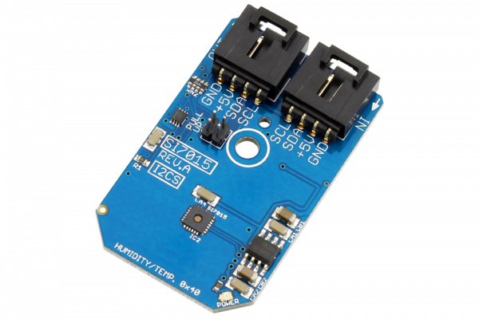

# SI7015

The SI7015 I2C Humidity and Temperature Sensor is a monolithic CMOS IC integrating:humidity and temperature sensor elements,an analog-to-digital converter,signal processing,calibration data, and an I2C Interface.
This Device is available from www.ncd.io 

[SKU: SI7015_I2CS]

(https://store.ncd.io/product/si7015-humidity-and-temperature-sensor-%C2%B14-5rh-%C2%B11c-i2c-mini-module/)
This Sample code can be used with Arduino.

Hardware needed to interface SI7015 sensor with Arduino

1. <a href="https://store.ncd.io/product/i2c-shield-for-arduino-nano/">Arduino Nano</a>

2. <a href="https://store.ncd.io/product/i2c-shield-for-arduino-micro-with-i2c-expansion-port/">Arduino Micro</a>

3. <a href="https://store.ncd.io/product/i2c-shield-for-arduino-uno/">Arduino uno</a>

4. <a href="https://store.ncd.io/product/dual-i2c-shield-for-arduino-due-with-modular-communications-interface/">Arduino Due</a>

5. <a href="https://store.ncd.io/product/si7015-humidity-and-temperature-sensor-%C2%B14-5rh-%C2%B11c-i2c-mini-module/">SI7015 Temperature and humidity Sensor</a>

6. <a href="https://store.ncd.io/product/i%C2%B2c-cable/">I2C Cable</a>

SI7015:

The SI7015 I2C Humidity and Temperature Sensor is a monolithic CMOS IC integrating:humidity and temperature sensor elements,an analog-to-digital converter,signal processing,calibration data, and an I2C Interface.

Applications:

• HVAC/R 

• Thermostats

• Instrumentation 

• White goods

• Weather stations

• Asset tracking and storage.

How to Use the SI7015 Arduino Library

The SI7015 has a number of settings, which can be configured based on user requirements.
          
1.Address calling:The following command is used to call the SI7015 sensor to begin the transmission.

          si.getAddr_SI7015(SI7015_DEFAULT_ADDRESS);           // 0x40

            
2.Fast mode:The following command is used to ENABLE the fast mode.

          si.setFastEnable(FAST_ENABLE_35);        // 35 ms (typical)  

3.Heater status:The following command is used to DISABLE the heater.

           si.setHeaterEnable(HEATER_OFF);      // Heater Off
             
4.Conversion mode:The following command is used to start the conversion mode.        
             
           si.setConversion(CONVERSION_START);       // Start a conversion

